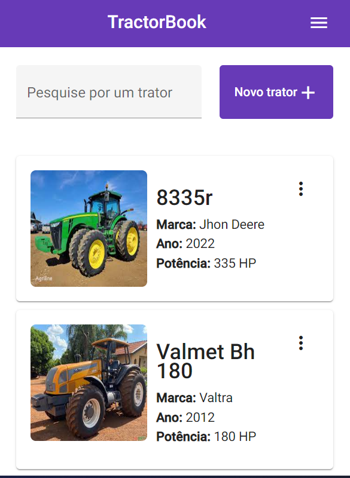

<h2>Android</h2>

<h2>Desktop</h2>

##  ✨ Tecnologias

Esse projeto foi desenvolvido com as seguintes tecnologias:

- [Angular](https://angular.io/)

- [Typescript](https://www.typescriptlang.org/)

- [Angular Material](https://material.angular.io/)

##  💻 Projeto

Aplicação feita para cumprir o desafio de código do eBarn, onde foi proposto um CRUD para gerenciamento de tratores.

##  🚀 Como executar

- Clone o repositório

- Instale as dependências com `yarn`

- Instale o pacote `http-server`, caso ainda não tenha como global

- Compile o projeto com `ng build`

- Execute o projeto com  `http-server dist/front-challenge`
